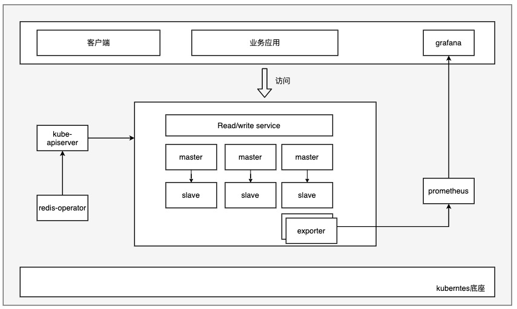
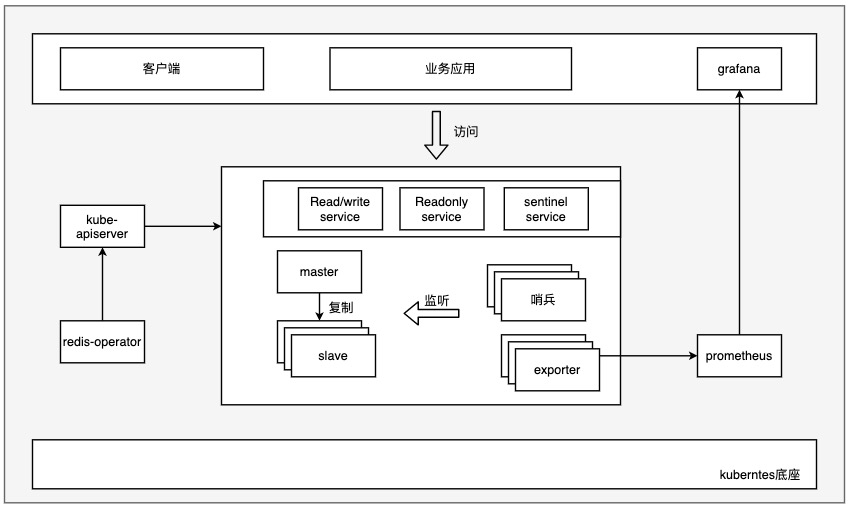

# redis-operator
[中文文档](./README-ZN.md)

redis-operator help operation and maintenance personnel quickly deploy redis clusters in various modes in kubernetes. Currently supports cluster mode and sentinel mode. 

Based on the kubernetes platform and operator technology, the high availability of redis can be guaranteed to the greatest extent

## Quick start
deploy operator
```
# install crd
kubectl apply -f chart/redis-operator/redis-crd.json

# install operator
helm install redis-operator chart/redis-operator
```
deploy redis
```
helm install redis chart/redis
```
verification

Ensure that all pods are in the running state
```
# kubectl get pod
NAME                              READY   STATUS    RESTARTS   AGE
redis-0                           2/2     Running   0          6m42s
redis-1                           2/2     Running   0          6m41s
redis-2                           2/2     Running   0          6m40s
redis-3                           2/2     Running   0          6m35s
redis-4                           2/2     Running   0          6m41s
redis-5                           2/2     Running   0          6m37s
redis-operator-695898677d-xcjl8   1/1     Running   0          6m47s
```
phase is Running, indicating that the redis cluster is in normal operation
```
kubectl get rediscluster redis -o yaml  |grep phase
phase: Running
```
## Architecture
### cluster mode
The cluster mode has been transformed on the basis of the native cluster
1. Quickly deploy the cluster, the node will automatically initialize and join the cluster
2. Each node distributes the reids data through the slots mechanism to ensure data reliability
3. Automatic node expansion and contraction
4. k8s service performs load balancing access to each reids instance


### Sentinel mode
The sentinel mode has been extended to a certain extent on the native redis sentinel.
1. Redis will automatically configure the master-slave cluster at the beginning of its creation, including master and slave roles
2. After the above steps are completed, start the sentry to start monitoring the redis master and slave, and guarantee the master based on the sentry's native capabilities.
3. Users can access redis based on the entry service of sentinel; at the same time, they can also access redis through the read-write separation service of redis master and slave


## Image packaging
set image registry
```
export registryURL="192.168.56.3:30088/middleware"
export tag=v1.5.6
```
build source code and image
```
cd redis-operator
make docker-build  IMG=$registryURL/redis-operator:$tag
make docker-push IMG=$registryURL/redis-operator:$tag
```
build other image
```
cd build 
make docker-build 
make docker-push 
```
## more
More documents, please refer to [doc](https://www.yuque.com/nq4era/chqywm/tgbepk)